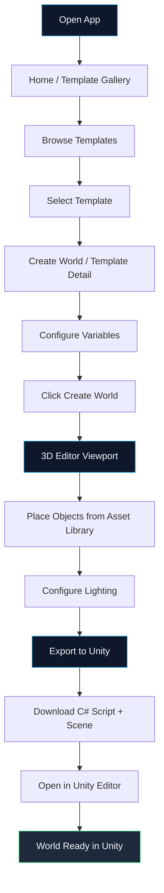
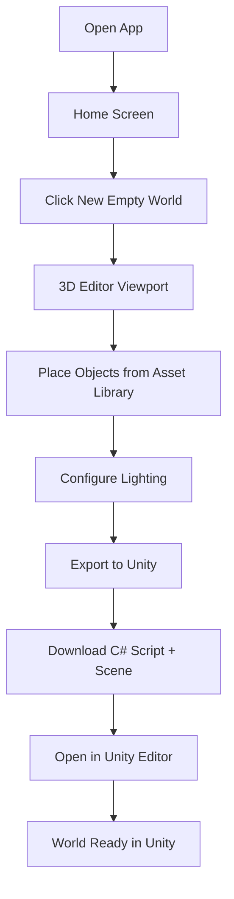
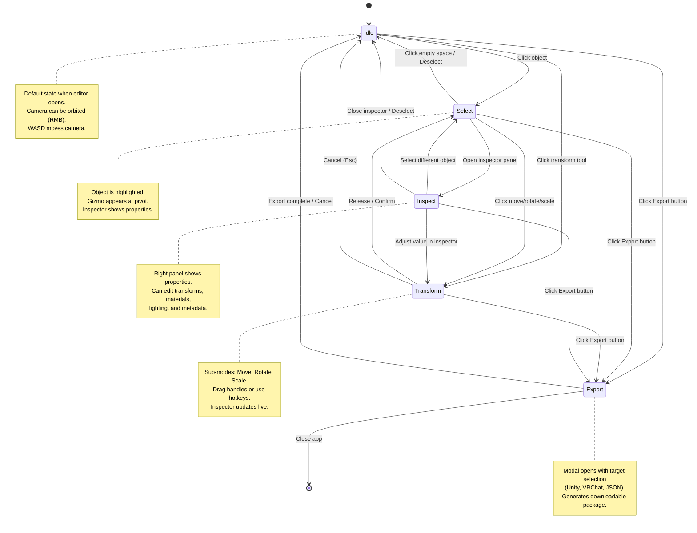
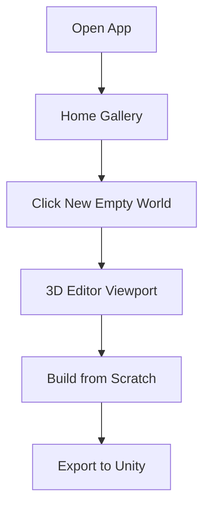
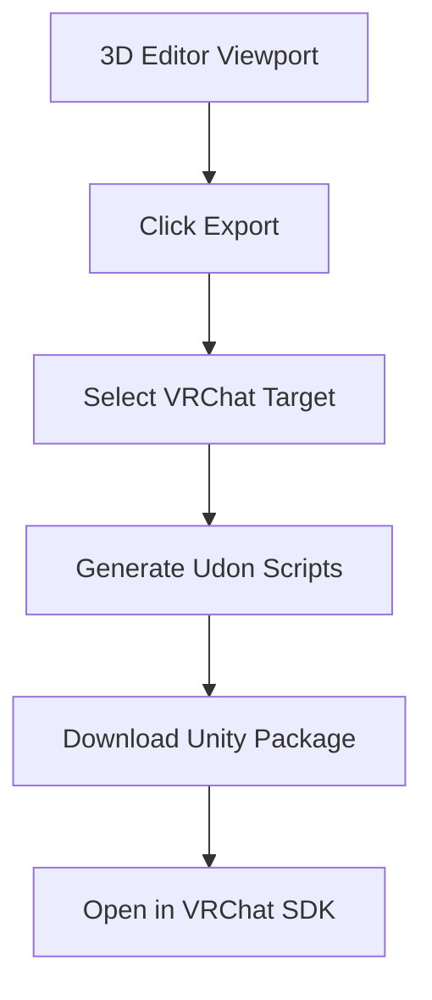

# User Flows

This document describes the primary user flows and state machine for the World Creator 3D world editor.

> **Scope note:** The happy path covers the full product vision, but the technology prototype (M0–M3) implements the editor and export flow only. The **template gallery / template variables** steps are Post-PoC (M4+). Basic lighting configuration is included in M0–M3.

---

## Happy Path: Template to Unity Export

### Scope for Technology Prototype (M0–M3)

The editor entry point for the technology prototype is a **"New Empty World"** button on the home screen. Template browsing, template detail, and variable configuration are deferred to Post-PoC (M4+). The M0–M3 happy path is therefore:

### Flow Description

1. **Open App**: User launches World Creator in the browser.
2. **Home / Template Gallery**: The landing screen shows a grid of pre-built world templates categorized by genre (RPG, Sci-Fi, Fantasy, Modern).
3. **Browse Templates**: User scrolls through templates, uses category tabs, or searches by name.
4. **Select Template**: User clicks on a template card (e.g., "Dungeon Crawl").
5. **Create World / Template Detail**: A detail page shows a large preview, description, tags, and configurable template variables.
6. **Configure Variables**: User adjusts sliders/values for variables like `room_count`, `trap_density`, `light_intensity`.
7. **Click Create World**: User clicks the primary CTA to instantiate the template.
8. **3D Editor Viewport**: The editor opens with the generated world loaded in the center viewport.
9. **Place Objects from Asset Library**: User drags assets (structures, props, lighting) from the left Asset Library panel into the 3D scene.
10. **Configure Lighting**: User selects lights and adjusts ambient color, intensity, and shadow settings in the right Inspector panel.
11. **Export to Unity**: User clicks the "Export" button in the top toolbar.
12. **Download C# Script + Scene**: A `.cs` Unity Editor script and a JSON scene file are generated and downloaded.
13. **Open in Unity Editor**: User imports the script into a Unity project and runs it.
14. **World Ready in Unity**: The scene is reconstructed in Unity with all placed objects, lighting, and materials.

---

## Editor State Machine

### State Definitions

| State | Description | User Actions |
|-------|-------------|--------------|
| **Idle** | No object selected. Camera navigation only. | Orbit, pan, zoom, click object, open asset library |
| **Select** | Object is selected. Gizmo visible. Inspector populates. | Click another object, deselect, switch tool, edit in inspector |
| **Transform** | Actively translating, rotating, or scaling the selected object. | Drag axis handles, type values, confirm (Enter), cancel (Esc) |
| **Inspect** | Inspector panel is focused for property editing. | Edit fields, pick colors, toggle booleans, select different object |
| **Export** | Export modal is open. Configuring export settings. | Choose target engine, set options, download, cancel |

### Transitions

- **Idle -> Select**: Left-click on any object in the 3D viewport.
- **Idle -> Transform**: Click a transform tool button (Move `W`, Rotate `E`, Scale `R`) without an object selected; selecting an object enters Transform directly.
- **Select -> Transform**: Click a transform tool or press `W`/`E`/`R`.
- **Select -> Inspect**: Inspector panel is already visible by default when an object is selected.
- **Transform -> Select**: Release mouse after dragging a handle, or press `Enter`.
- **Transform -> Idle**: Press `Esc` to cancel the transform and deselect.
- **Inspect -> Transform**: Change a transform value (position, rotation, scale) in the Inspector.
- **Any -> Export**: Click the "Export" button in the top toolbar or press `Ctrl+E`.
- **Export -> Idle**: Export completes or user cancels the modal.

---

## Alternative Flows

### Quick Start from Empty

### VRChat Export (Future)

---

## Keyboard Shortcuts Reference

> **Scope note:** WASD camera movement is active only when no text input or property field is focused. When an input is focused, `W`/`A`/`S`/`D` are treated as text entry.

| Shortcut | Action | State |
|----------|--------|-------|
| `WASD` | Move camera | Idle, Select, Transform |
| `RMB + Drag` | Orbit camera | Idle, Select, Transform |
| `Scroll` | Zoom camera | Idle, Select, Transform |
| `Q` | Select tool | Any -> Select |
| `W` | Move tool | Any -> Transform (Move) |
| `E` | Rotate tool | Any -> Transform (Rotate) |
| `R` | Scale tool | Any -> Transform (Scale) |
| `Esc` | Cancel / Deselect | Transform -> Idle, Select -> Idle |
| `Delete` | Delete selected object | Select -> Idle |
| `Ctrl+E` | Open Export modal | Any -> Export |
| `Ctrl+Z` | Undo | Any |
| `Ctrl+Shift+Z` | Redo | Any |
